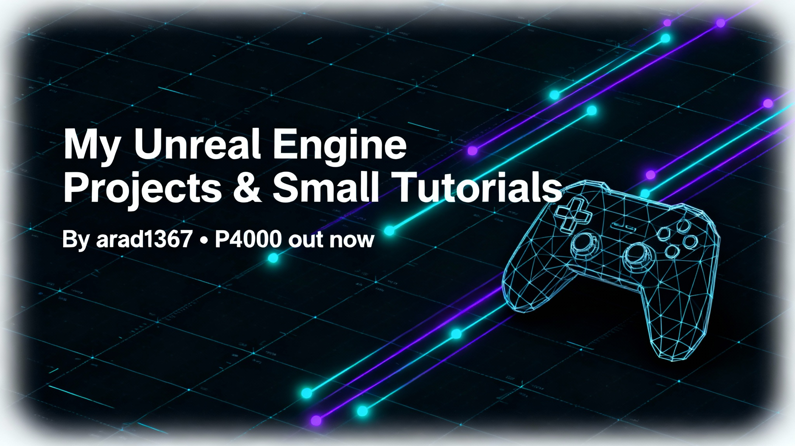

### My_UnrealEngine_Projects_Small_Tutorials

Very briefly: In this repo, I share some of my Unreal Engine projects and small tutorials. It’s a growing collection of experiments, tips, and mini-projects to help others learn and build faster.

- Recently, I published a game: P4000 — you can download and play it here: https://pejman1367.itch.io/p4000
- GitHub: https://github.com/arad1367

#### Contact
- Email: pejman.ebrahimi77@gmail.com
